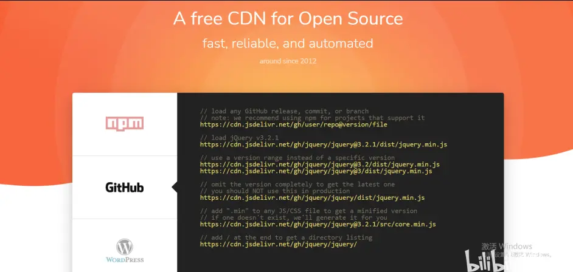
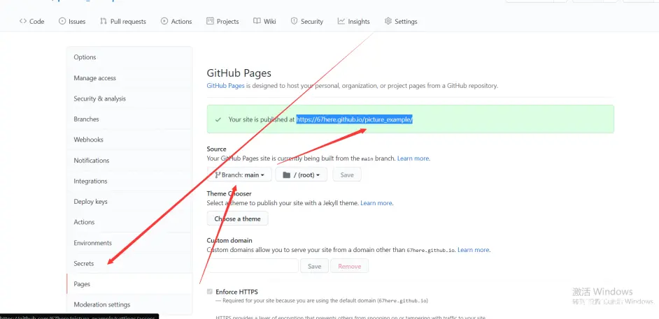
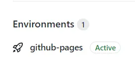
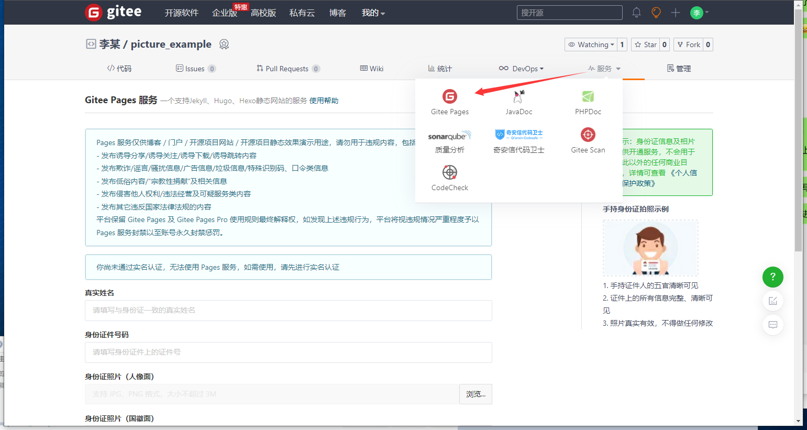

+++
title = "打造 Github 和 Gitee 的图床"
date = 2022-01-17
slug = "host-images-on-github-and-gitee"

[extra]
author = "67here"
cover= "cover.png"

[taxonomies]
tags = ["工具妙用", "图床"]
+++

## 一、用途

用来给自己的帖子、博客上传图片等资料，比如在支持 MarkDown 编辑器的论坛网站中，直接贴上链接，就可以直接展示出图片，不会受论坛自身的附件限制，国内的其它图床，或者是收费，或者是有效期限制，如果只是发发贴这种小需求，就可以借助免费的 GitHub 和 gitee 来做自己的图床，十分简便，这篇帖子就是如此。

## 二、开始制作

打造图床，只要在网页上配置即可，Picgo 等软件只是额外的管理工具，非必要。

### 1）方式 1：raw 地址

只需要新建库，上传图片，复制并修改链接，三步，非常简单
效果如下

这两张图片的 MarkDown 链接是：

``

``

格式就是
https://raw.githubusercontent.com/用户名/库名/分支名/文件路径
https://gitee.com/用户名/库名/raw/分支名/文件路径
这里 master 和 main 都是主分支的意思，Gitee 的格式也是如此，只不过中间需要多加一个 raw.

上面我贴出了两张图片，但是你很大概率只会看到一个 Gitee 的记事本图片，科学上网后就能看到两张，国内访问 GitHub 是不稳定的，解决方式是使用分流的国内 CDN 节点

MarkDown 链接

``

这里 **cdn.jsdelivr.net/gh** 是必须要加的前缀，main 是分支的名字

我自己在用的就是 Gitee 改网址，效果比 GitHub 的 CDN 好。(缺点是 Gitee 限制图片大小 1MB 内)

### 2）方式 2：网页托管

它的用途是在没有个人域名和服务器的情况下显示出完整的自定网页，做图床有些大材小用，但也是个方法。

设置成功之后，项目的右下角会出现一个小火箭

MarkDown 链接：
``

设置托管时，分支早已指定，所以网址里不再写。
相比于上面的方法，弊端是更新会略慢一点，不过 GitHub 在使用托管后，国内也可以直接看，但加载仍然会慢些。

至于 gitee 的托管页面，它需要上传手持身份证，我不想上传，暂时没这个需求，所以我也不清楚里面的细节，算是偷了个懒，哈哈

