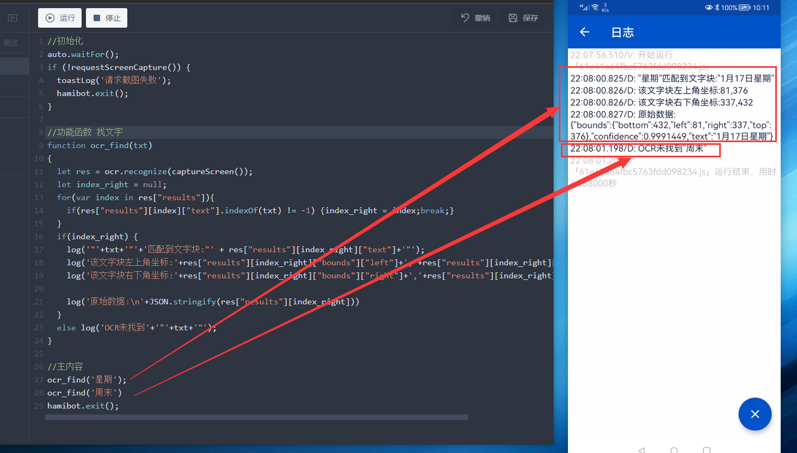
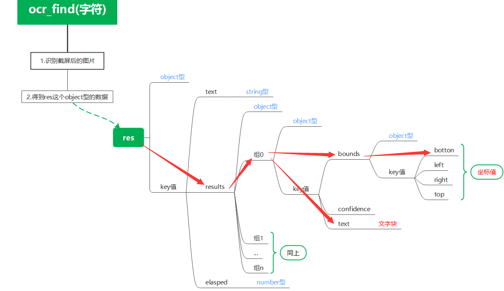
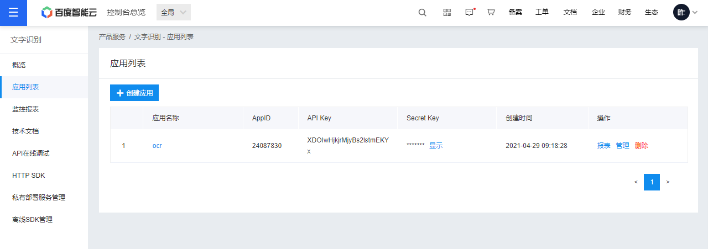

+++
title = "Hamibot 中 OCR 识字的使用示例"
date = 2022-01-18
slug = "Hamibot 中 OCR 识字的使用示例"


[extra]
author = "67here"
cover= "cover.png"

[taxonomies]
tags = ["技术杂谈", "OCR"]
+++

## 用途

它是在游戏或者某些层级复杂的页面中，无法 get 控件下的方法。
将示例**本地识别**和调用**百度云**的两种识别方式。
本地识别的优点是速度快且稳定，免费；云识别的优点是识图能力强大。

## 两种方式

### 1）使用 hamibot 自带的本地识别

```javascript
//初始化
auto.waitFor();
if (!requestScreenCapture()) {
  toastLog('请求截图失败');
  hamibot.exit();
}
sleep(3000); //防止识别到截图请求框上
//功能函数 找文字
function ocr_find(txt) {
  let res = ocr.recognize(captureScreen());
  let index_right = null;
  for (var index in res['results']) {
    if (res['results'][index]['text'].indexOf(txt) != -1) {
      index_right = index;
      break;
    }
  }
  if (index_right) {
    log(
      '"' +
        txt +
        '"' +
        '匹配到文字块:"' +
        res['results'][index_right]['text'] +
        '"'
    );
    log(
      '该文字块左上角坐标:' +
        res['results'][index_right]['bounds']['left'] +
        ',' +
        res['results'][index_right]['bounds']['top']
    );
    log(
      '该文字块右下角坐标:' +
        res['results'][index_right]['bounds']['right'] +
        ',' +
        res['results'][index_right]['bounds']['bottom']
    );

    log('原始数据:\n' + JSON.stringify(res['results'][index_right]));
  } else log('OCR未找到' + '"' + txt + '"');
}

//主内容
ocr_find('星期');
ocr_find('周末');
hamibot.exit();
```

效果图：

这里新建了一个函数 ocr_find()
它的功能是：如果找到括号内字符，就返回其在屏幕上的坐标，反之，则提示。
大致流程如下

所以 res["results"][index_right]["bounds"]["left"] 就可以定位到原始分析数据中某一组的左边框坐标，使用 for/in 遍历，即可匹配出要找的字符串。再之后就可以拿到它的详细信息，怎么使用它就自由发挥了。

### 2）调用百度云 OCR 模块

```javascript
//初始化
auto.waitFor();
if (!requestScreenCapture()) {
  toastLog('请求截图失败');
  hamibot.exit();
}
sleep(3000);

//百度OCR 函数
//1）点击字符
function ocr_click(target_words) {
  let imgScreen = captureScreen();
  let logOcr = Baidu_ocr(imgScreen);
  let target_nums = 0;

  for (i = 0; i < logOcr.length; i++) {
    if (target_words == logOcr[i].words) {
      console.log('找到：' + target_words);
      target_nums = i;
      break;
    }
  }
  if (!target_nums) {
    log('未找到指定文字');
    return false;
  }
  let postion = new Array();

  postion[1] = logOcr[target_nums].location.top;
  postion[0] = logOcr[target_nums].location.left;
  sleep(500);

  click(postion[0], postion[1]);
  return postion;
}
//2）返回百度的原始分析数据
function Baidu_ocr(imgFile) {
  log('识图...');
  var imag64 = images.toBase64(imgFile, 'png', 100);
  var API_Key = '你的AK';
  var Secret_Key = '你的SK';
  var getTokenUrl = 'https://aip.baidubce.com/oauth/2.0/token'; //选择网络图片识别
  var token_Res = http.post(getTokenUrl, {
    grant_type: 'client_credentials',
    client_id: API_Key,
    client_secret: Secret_Key,
  });
  var access_token = token_Res.body.json().access_token;
  var ocrUrl = 'https://aip.baidubce.com/rest/2.0/ocr/v1/webimage_loc';
  var ocr_Res = http.post(ocrUrl, {
    headers: {
      'Content - Type': 'application/x-www-form-urlencoded',
    },
    access_token: access_token,
    image: imag64,
    language_type: 'CHN_ENG', //可添加额外参数
  });
  sleep(1000);
  var json = ocr_Res.body.json();
  return json.words_result;
}

//运行
ocr_click('晚上');
hamibot.exit();
```


这里是你的 AK 和 SK，百度云内的操作不再细说。

先看第二个函数 **function Baidu_ocr**，简单说就是 1)将图片 转为 base64 2)填好自己的账号信息，选择图片参数(详细见官网文档) 3)将这些信息 post 给百度云 4)拿到百度云返回的数据

看第一个函数 **function ocr_click** 1.截屏，图片传给 **function Baidu_ocr** 拿到百度云的识别结果 2.用 for 去一个个比对，匹配成功则返回，无结果就提示 3.拿到坐标，点击其左上角
这里百度云返回的数据和上面 hamibot 自带识别的数据都是层层堆叠的，需要一层一层剥开，我这里比对的都是文字，你可以比对坐标。

或者自定义些别的功能，比如：记录某字符串在屏幕上出现的次数和位置

```javascript
//OCR 记录所有相同字的位置
function list_ocr(target_words) {
  sleep(2000);
  let img = captureScreen();
  let logOcr = Baidu_ocr(img);
  let nums_list = new Array();
  let times = 0;

  for (i = 0; i < logOcr.length; i++) {
    if (target_words == logOcr[i].words) nums_list[times++] = i;
  }
  if (!times) {
    log('未找到指定文字');
    return false;
  } else log('找到' + times + '个');

  var postion = new Array();
  for (k = 0; k < times; k++) {
    postion[k] = new Array();
  }
  for (i = 0; i < times; i++) {
    postion[i][0] = logOcr[nums_list[i]].location.left;
    postion[i][1] = logOcr[nums_list[i]].location.top;
  }
  return postion;
}
```

## 注意

1.有时，屏幕上有“星期一”，但是搜索“星期一”却搜不到，大概率是被识别成“星期”和“一”两组，所以匹配不到，
可以 减少关键字 或者是拆分成单字去搜索，识别结果以组合数最多的为最高优先...方法自选。
