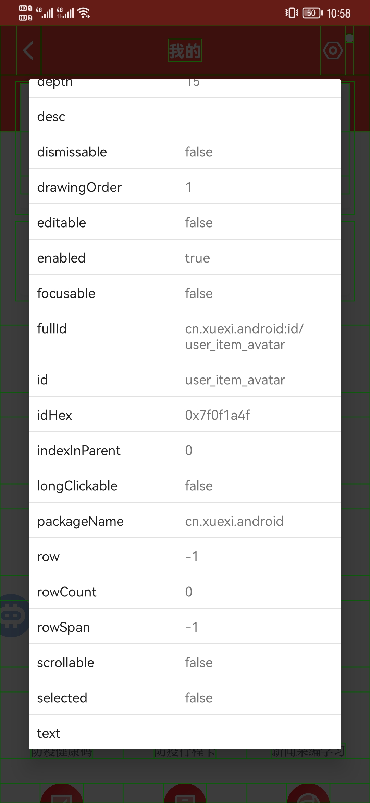

+++
title = "如何点击无法点击的控件"
date = 2022-01-26
slug = "如何点击无法点击的控件"


[extra]
author = "dundunnp"
cover= "cover.png"

[taxonomies]
tags = ["技术杂谈"]
+++

## 问题来源

很多时候我们需要对某个控件进行点击操作，当控件的 clickable 为 true 时，可以很方便的用 `click()` 方法进行点击，但是当 clickable 为 false 时，这个方法好像就不适用了，那么如何对无法点击的控件也即 clickable 为 false 的控件进行点击呢？以下提供了一种方法


## 解决思路

每一个控件不管是否可点击，都是有 bounds 属性的，我们可以利用 bounds()的属性 centerX()、centerY()获取控件 tmp 的中点 x 坐标、中点 y 坐标
再利用 click(控件的中点 x 坐标, 控件的中点 y 坐标)点击无法点击的控件

## 解决实例

以第一个图举例子，我们再看看它的其他特性



因此我们可以利用 id 属性获取该控件，并保存为 tmp：

```js
var tmp = id('user_item_avatar').findOne();
```

接下来利用 bounds 的两个属性点击

```js
click(tmp.bounds().centerX(), tmp.bounds().centerY());
```

就可以完成对无法点击控件的点击了

## 广告

由于某些原因，QG 脚本已经在市场下架，但...开源万岁！，我们还是可以通过源码在自己的脚本控制台上运行，具体操作请访问[链接](https://github.com/dundunnp/hamibot-auto_xuexiqiangguo)
https://github.com/dundunnp/hamibot-auto_xuexiqiangguo
