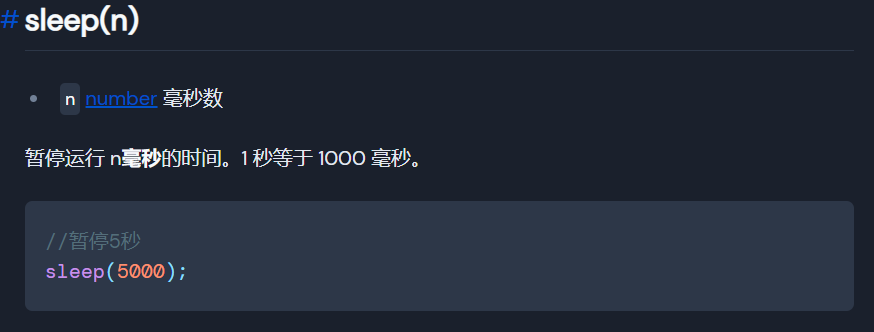
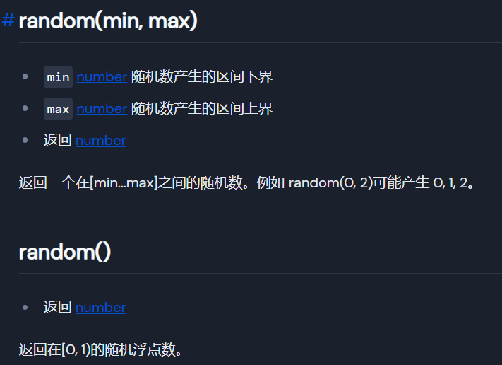

+++
title = "让操作看起来像人"
date = 2022-01-27
slug = "让操作看起来像人"


[extra]
author = "dundunnp"
cover= "cover.png"

[taxonomies]
tags = ["技术杂谈"]
+++

# Why

当用代码

```js
while (!click('a'));
while (!click('b'));
while (!click('c'));
```

飞速的在控件a、b和c跳转时，确实让人感觉到“快感”，

在快节奏的时代下，人们总是喜欢快的，但对于一个**合格**的脚本来说，这明显不是一个好的命题

如果你不想让软件检测出你用**非常人**的速度而判定你是脚本的话，那你就一定要利用好sleep函数和random函数

# What

首先我们需要了解两个函数：

## sleep函数

[官网](https://docs.hamibot.com/reference/globals/#sleepn)介绍如下：



## random函数

[官网](https://docs.hamibot.com/reference/globals#randommin-max)介绍如下：



# How

了解了sleep和random函数后，就可以让我们的脚本更像人了
如果是一个正常人，我们会在控件a与b之间跳转时会有**迟钝**，而且这个迟钝是一个**随机**的，这里假设我们的迟钝时间是在500ms~1000ms之间，那么我们可以修改代码为

```js
while (!click('a'));
sleep(random(500, 1000));
while (!click('b'));
sleep(random(500, 1000));
while (!click('c'));
```

这样就可以让我们的脚本更像人

# How进阶

我们既然可以在**时间**上“做手脚”，那么当然也可以对**空间**上“做手脚”

对于无法点击的控件的点击（如果不了解的可以看看我的[另一篇博客]()），按传统的方法只是点击控件的中点坐标（中点 x 坐标、中点 y 坐标）

```js
# 例子
var tmp = id('user_item_avatar').findOne();
click(tmp.bounds().centerX(), tmp.bounds().centerY());
```

但控件点击范围是一个长方形，在整个长方形内都可以点击

对于一个正常人点击一个控件肯定不是一直点在一个控件的中心点，因此我们也要让脚本随机点在某个位置上

在[官网](https://docs.hamibot.com/reference/widgetsBasedAutomation#rect)上还可以找到bounds()的其他属性

**left** 长方形左边界的 x 坐标

**right** 长方形右边界的 x 坐标

**top** 长方形上边界的 y 坐标

**bottom** 长方形下边界的 y 坐标

```js
# 例子
var tmp = id('user_item_avatar').findOne();
var randomX = random(tmp.bounds().left, tmp.bounds().right);
var randomY = random(tmp.bounds().top, tmp.bounds().bottom);
click(randomX, randomY);
```

有了这两个属性就可以写出随机点在长方形内某个位置的代码了

# 广告

由于某些原因，QG脚本已经在市场下架，但...开源万岁！，我们还是可以通过源码在自己的脚本控制台上运行，具体操作请访问[链接](https://github.com/dundunnp/hamibot-auto_xuexiqiangguo)
https://github.com/dundunnp/hamibot-auto_xuexiqiangguo
