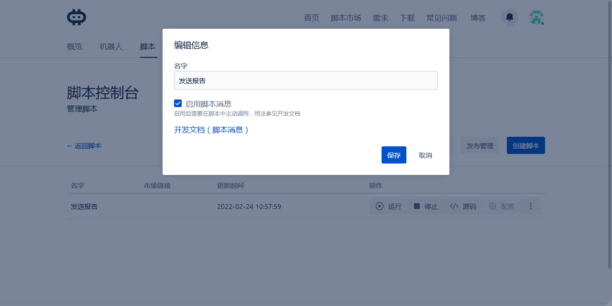
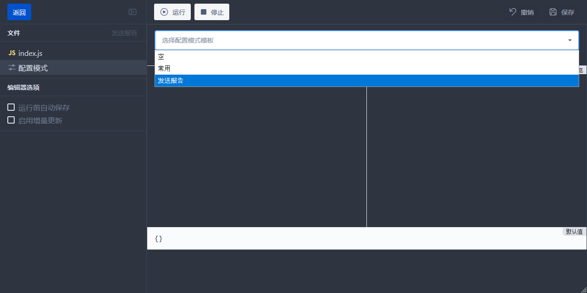
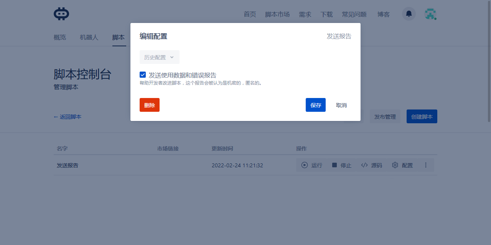
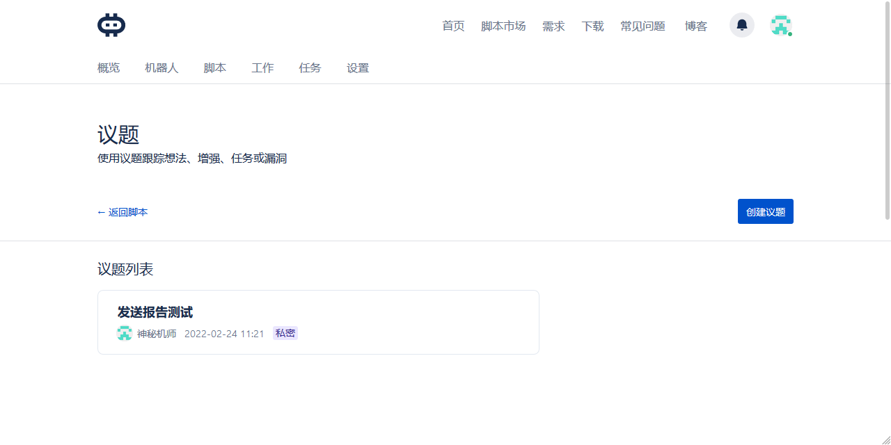
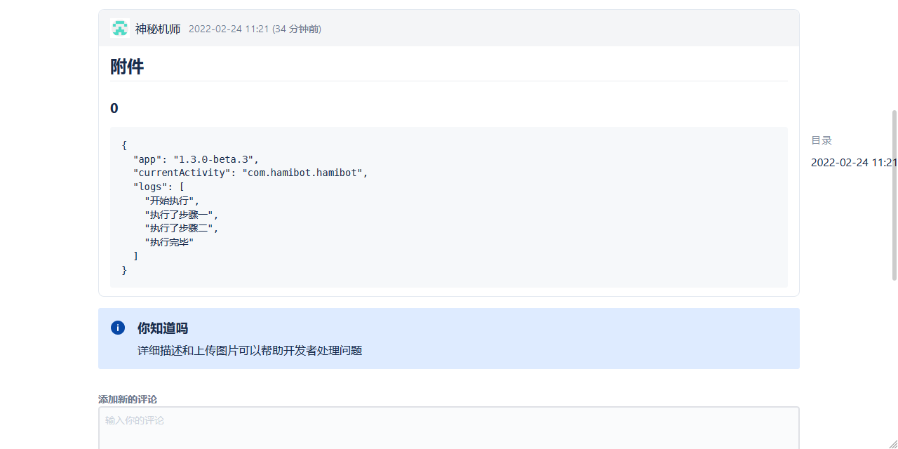

+++
title = "脚本如何收集错误报告"
date = 2022-02-24
slug = "脚本如何收集错误报告"

[extra]
cover= "cover.png"

[taxonomies]
tags = ["HAMI 进阶"]
+++

Android 的特性，注定用户的环境会很多样，常常自己运行正常，到其他设备则报错。


想要发现问题，目前最常见的方式是用户反馈，通过评论，微信等等，但是往往效率较低，需要不断沟通，且不是所有用户都有意愿去反馈，因此 [Hamibot](https://hamibot.com) 提供了[发送报告](https://docs.hamibot.com/reference/hamibot#%E5%8F%91%E9%80%81%E6%8A%A5%E5%91%8A)，通过收集信息，主动发现问题，帮助改进脚本。

## 如何使用

这里我们新建一个脚本，具体步骤这里就不赘述了，参见 [创建脚本](https://docs.hamibot.com/tutorials/tutorial-create-script)。

1. 编辑脚本信息，勾选 **✅ 启用脚本消息**。

> 勾选启用脚本消息，重要的事情说三遍

> 勾选启用脚本消息，重要的事情说三遍

> 勾选启用脚本消息，重要的事情说三遍



2. 进入源码，在配置模式中，选择模板-发送报告。



3. 回到脚本编辑，这里我们用简单的代码进行示例。

```js
auto.waitFor();
// 脚本配置
const { TELEMETRY } = hamibot.env;
const logs = [];

// 你自己的代码，这里只是简单演示
logs.push('开始执行');
toastLog('步骤一');
logs.push('执行了步骤一');
sleep(2000);
toastLog('步骤二');
logs.push('执行了步骤二');
sleep(2000);
logs.push('执行完毕');

// 发送报告
hamibot.postMessage(Date.now().toString(), {
  telemetry: TELEMETRY, // 由用户决定是否发送报告
  data: {
    title: '发送报告测试',
    attachments: [
      {
        type: 'json',
        data: JSON.stringify({
          // 要收集的信息，根据脚本需要自行收集，这里仅作演示
          app: app.versionName, // Hamibot 版本
          currentActivity: currentActivity(), // 当前运行的 Activity
          // 自定义日志，仅作参考
          logs: logs,
        }),
      },
    ],
  },
});
// 发送后退出脚本，避免直接使用 exit()
hamibot.exit();
```

4. 在脚本配置中勾选 **✅ 发送使用数据和错误报告**。



5. 运行脚本，稍后即可在[议题](https://hamibot.com/dashboard/issues)中看到。





## 结语


通过[发送报告](https://docs.hamibot.com/reference/hamibot#%E5%8F%91%E9%80%81%E6%8A%A5%E5%91%8A)，我们可以主动收集使用数据和错误报告，除了文中演示，你还可以收集更多其他数据，甚至是图片，具体用法可参见文档。

- [Hamibot 文档](https://docs.hamibot.com/reference/hamibot#%E5%8F%91%E9%80%81%E6%8A%A5%E5%91%8A)
