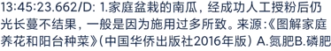
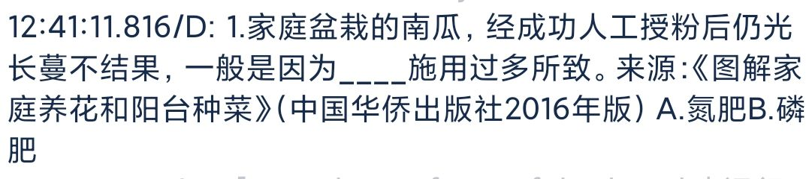

+++
title = "Hamibot 自带 OCR 的一些改进" 
date = 2022-01-28 
slug = "Hamibot 自带 OCR 的一些改进"

[extra]
author = "十二" 
cover = "cover.png"

[taxonomies]
tags = ["技术杂谈", "OCR"]
+++

## 开发文档中提供两种调用方式

1.  ocr.recognize(img[,level]) - 识别图片中的文字。

2.  ocr.recognizeText(img) - 识别图片中的文字，只返回文本结果。

## 使用中的问题

在使用 recognizeText 识别文字时,常常会出现文字顺序错乱的情况
例如:

使用代码:

```js
let img = images.read('/sdcard/t.png');

log(ocr.recognizeText(img));
```

识别结果如下: 有很明显的顺序错乱


## 解决方法

好在开发文档中提供了 `ocr.recognize(img[,level])`,得到的识别结果是分段的,而且每段都具有相应的坐标
使用代码:

```js
let img = images.read('/sdcard/t.png');

log(ocr.recognize(img));
```


那么就能通过对每段的坐标进行比较排序,最终将段落文本相加得到一个顺序相对正确的文本.

## 代码:

```js
function Gets_Words() {
  let list = ocr.recognize(arguments[0])['results']; // 识别文字，并得到results
  let eps = 40; // 坐标误差
  if (arguments.length >= 2) eps = arguments[1];
  for (
    var i = 0;
    i < list.length;
    i++ // 选择排序对上下排序,复杂度O(N²)但一般list的长度较短只需几十次运算
  ) {
    for (var j = i + 1; j < list.length; j++) {
      if (list[i]['bounds']['bottom'] > list[j]['bounds']['bottom']) {
        var tmp = list[i];
        list[i] = list[j];
        list[j] = tmp;
      }
    }
  }

  for (
    var i = 0;
    i < list.length;
    i++ // 在上下排序完成后，进行左右排序
  ) {
    for (var j = i + 1; j < list.length; j++) {
      // 由于上下坐标并不绝对，采用误差eps
      if (
        Math.abs(list[i]['bounds']['bottom'] - list[j]['bounds']['bottom']) <
          eps &&
        list[i]['bounds']['left'] > list[j]['bounds']['left']
      ) {
        var tmp = list[i];
        list[i] = list[j];
        list[j] = tmp;
      }
    }
  }
  let res = '';
  for (var i = 0; i < list.length; i++) {
    res += list[i]['text'];
  }
  return res;
}
log(Gets_Words(img));
log(Gets_Words(img, 50));
```

**最终效果:**


---

但是这并不符合这张图片的实际内容呀！！！，其中的下划线并没有被识别


所以以下代码专门为此类型的文字识别做出优化

代码：

```js
let img = images.read('/sdcard/t.png');

function Gets_Words() {
  let list = ocr.recognize(arguments[0])['results']; // 识别文字，并得到results
  let eps = arguments[1] != null ? arguments[1] : 40; // 坐标误差
  for (
    var i = 0;
    i < list.length;
    i++ // 冒泡排序对上下排序
  ) {
    for (var j = i + 1; j < list.length; j++) {
      if (list[i]['bounds']['bottom'] > list[j]['bounds']['bottom']) {
        var tmp = list[i];
        list[i] = list[j];
        list[j] = tmp;
      }
    }
  }

  for (
    var i = 0;
    i < list.length;
    i++ // 在上下排序完成后，进行左右排序
  ) {
    for (var j = i + 1; j < list.length; j++) {
      // 由于上下坐标并不绝对，采用误差eps
      if (
        Math.abs(list[i]['bounds']['bottom'] - list[j]['bounds']['bottom']) <
          eps &&
        list[i]['bounds']['left'] > list[j]['bounds']['left']
      ) {
        var tmp = list[i];
        list[i] = list[j];
        list[j] = tmp;
      }
    }
  }

  let left = 0,
    right = 0;
  for (
    var i = 0;
    i < list.length;
    i++ //记录最左边和最右边的坐标
  ) {
    left = Math.max(left, list[i]['bounds']['left']);
    right = Math.max(right, list[i]['bounds']['right']);
  }
  let res = list[0]['text'];
  let space = arguments[2] != null ? arguments[2] : 100; // 下划线大小
  var flag = true;
  for (var i = 1; i < list.length; i++) {
    if (list[i]['text'][0] == 'A') flag = false;
    // 当该行的文本中间位置有下划线时
    if (
      flag &&
      Math.abs(list[i]['bounds']['bottom'] - list[i - 1]['bounds']['bottom']) <
        eps &&
      list[i]['bounds']['left'] - list[i - 1]['bounds']['right'] > space
    )
      (res += '____'), (flag = false);
    // 当最左和最右位置有下划线时
    else if (
      flag &&
      Math.abs(list[i]['bounds']['bottom'] - list[i - 1]['bounds']['bottom']) >
        eps &&
      (right - list[i - 1]['bounds']['right'] > space ||
        list[i]['bounds']['left'] - left > space)
    )
      (res += '____'), (flag = false);
    res += list[i]['text'];
  }
  return res;
}

// 调用方式 Gets_Words(img,(a),(b)) a为上下行的坐标差，b为下划线的长度，默认40，100
log(Gets_Words(img));
log(Gets_Words(img, 30, 100));
```

**识别结果：**


