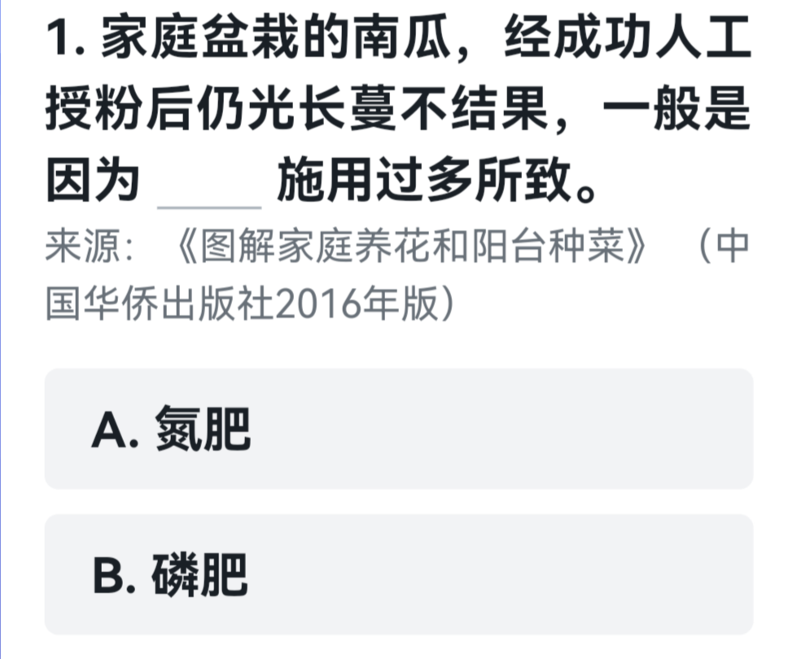
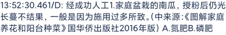
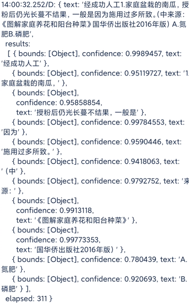

 Hamibot自带OCR的一些改进

---


## 开发文档中提供两种调用方式
---

 1.  ocr.recognize(img[,level]) - 识别图片中的文字。

2. ocr.recognizeText(img) - 识别图片中的文字，只返回文本结果。

---

## 使用中的问题
在使用recognizeText识别文字时,常常会出现文字顺序错乱的情况
例如:
使用代码:

```cpp
let img = images.read('/sdcard/t.png');

log(ocr.recognizeText(img));
```
识别结果如下: 有很明显的顺序错乱


## 解决方法
好在开发文档中提供了 `ocr.recognize(img[,level])`,得到的识别结果是分段的,而且每段都具有相应的坐标
使用代码:

```cpp
let img = images.read('/sdcard/t.png');

log(ocr.recognize(img));
```



那么就能通过对每段的坐标进行比较排序,最终将段落文本相加得到一个顺序相对正确的文本.

## 代码:

```cpp
function Gets_Words(){
    let list = ocr.recognize(arguments[0])['results'];       // 识别文字，并得到results
 	let eps = 40;                                           // 坐标误差
  	if(arguments.length >= 2) eps = arguments[1];
    for(var i = 0; i < list.length; i++)                        // 选择排序对上下排序,复杂度O(N²)但一般list的长度较短只需几十次运算
    {
        for(var j = i+1; j < list.length; j++)
        {
            if(list[i]['bounds']['bottom']>list[j]['bounds']['bottom'])
            {
                var tmp = list[i];
                list[i] = list[j];
                list[j] = tmp;
            }
        }
    }

    for(var i = 0; i < list.length; i++)                        // 在上下排序完成后，进行左右排序
    {
        for(var j = i+1; j < list.length; j++)
        {
            // 由于上下坐标并不绝对，采用误差eps
            if(Math.abs(list[i]['bounds']['bottom']-list[j]['bounds']['bottom']) < eps && list[i]['bounds']['left'] > list[j]['bounds']['left'])
            {
                var tmp = list[i];
                list[i] = list[j];
                list[j] = tmp;
            }
        }
    }
    let res = '';
    for(var i = 0; i < list.length; i++)
    {
        res += list[i]['text'];
    }
    return res;
}
log(Gets_Words(img));
log(Gets_Words(img, 50));

```

